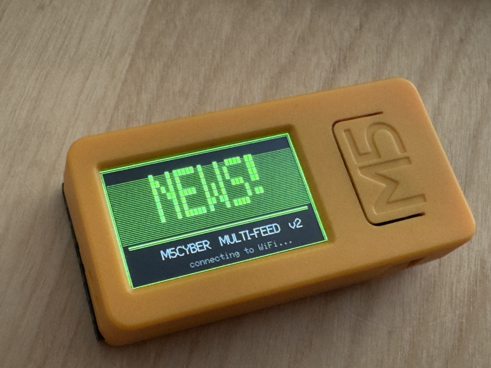
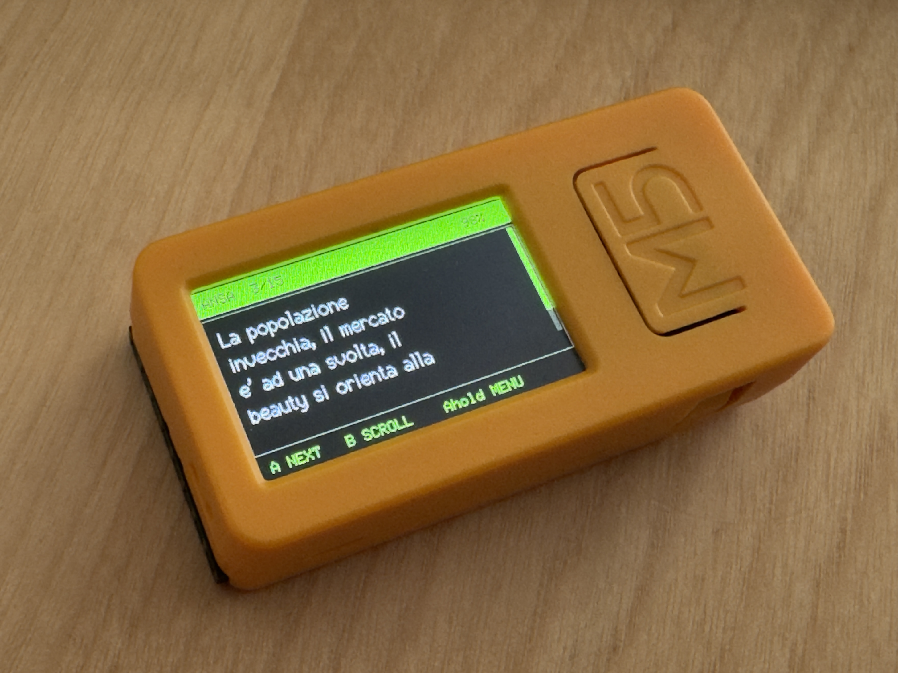
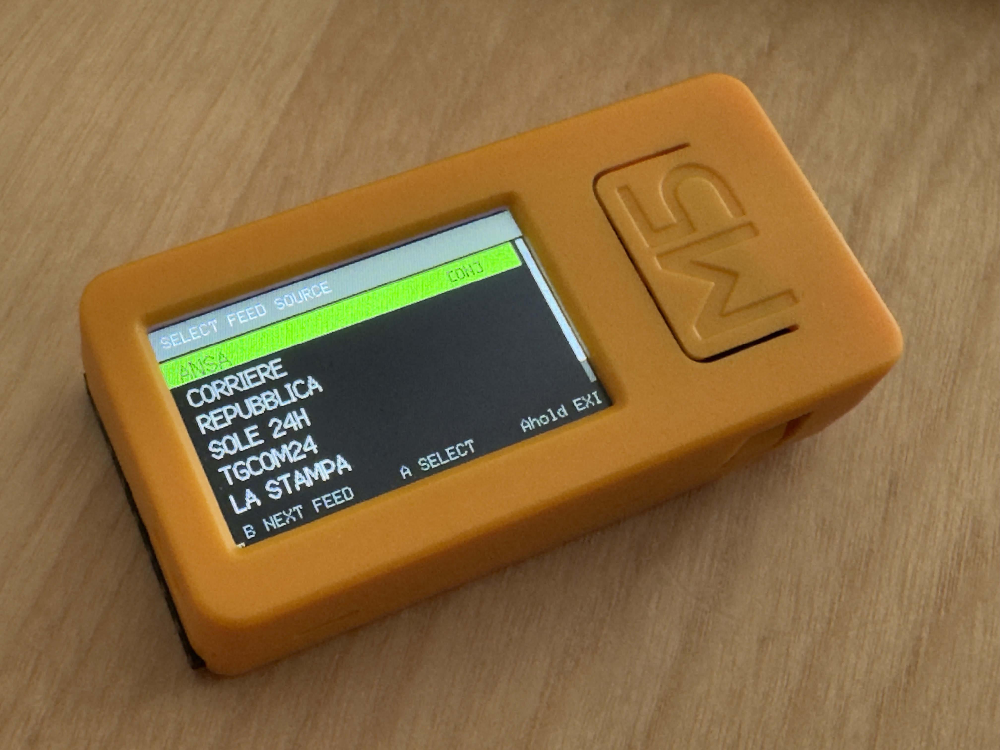

# M5CYBER NEWS



**M5CYBER NEWS** is a standalone Italian RSS news reader and NTP clock that
runs on the
[M5StickC Plus2](https://docs.m5stack.com/en/core/M5StickC%20PLUS2) — a
thumb-sized ESP32 device with a 1.14" colour display.

No phone. No app. No subscription. Press a button and read the headlines.

When idle it shows a full-screen clock. Press a button to open the menu, pick
one of seven major Italian outlets, and read fresh headlines fetched directly
over WiFi. After 30 seconds of inactivity it slips back to the clock face.

It is designed to sit on a desk, in a workshop, or in a pocket: something
glanceable and distraction-free for staying informed during the day.


-blue)


---

## Screenshots

| Splash screen | Reading news | Feed menu |
|:---:|:---:|:---:|
|  |  |  |
| Pixel-art boot screen | Headlines word-wrapped, scrollbar on the right, source and battery in the header | Switch between feeds, clock, and power off |

---

## Features

### News reader
- **7 Italian news feeds** — ANSA, Corriere della Sera, Repubblica, Il Sole 24 Ore,
  TGcom24, La Stampa, Il Fatto Quotidiano.
- **On-device feed menu** — switch source without reflashing.
- **Per-source colour coding** — the header colour tells you which outlet you
  are reading at a glance.
- **Word-wrapped headlines** with a proportional vertical scrollbar for long
  titles.
- **Auto-refresh** every 60 seconds in the background.
- **Robust RSS text cleaning** — HTML entities, UTF-8 accented vowels,
  typographic quotes, Windows-1252 leftovers, and CDATA wrappers are all
  stripped before display.

### Clock
- **Full-screen NTP clock** as the idle/home screen — large time, date, and
  detected location in the header.
- **Automatic geolocation** — on first run the device detects its country and
  UTC offset by IP (via ipapi.co, with FreeGeoIP as fallback).
- **Manual timezone setter** — a clear, structured on-screen menu to pick the
  UTC offset by hand if automatic detection is unavailable.
- **Auto-return to clock** — after 30 seconds idle in news mode the display
  returns to the clock face.

### System
- **Startup and shutdown jingles** — short melodies played through the built-in
  buzzer on power-on and power-off.
- **BYE BYE screen + POWER OFF** — a dedicated menu entry cleanly powers the
  device down with a farewell screen, so you always know it is off.
- **Persistent storage (NVS)** — timezone, location, and last-used feed are
  saved to flash and survive a full power cycle.
- **Fast boot** — once the timezone is saved, the device skips network
  geolocation entirely and connects straight away.
- **Pixel-art splash screen** — bitmap "NEWS!" drawn at boot from a custom 5×7
  pixel font rendered with `fillRect()`.
- **Battery saver** — display dims after 12 s of inactivity, sleeps after 20 s;
  first button press wakes it without triggering an action.
- **WiFi captive portal** — first-run setup via WiFiManager; credentials are
  saved to flash and survive reboots. No hardcoded passwords.

---

## Hardware

| Component | Notes |
|-----------|-------|
| **M5StickC Plus2** | ESP32-PICO, 240×135 px ST7789V2 display, 200 mAh battery, built-in buzzer |
| USB-C cable | For flashing only |
| 2.4 GHz WiFi | For fetching feeds and time sync |

---

## Feed sources

| # | Outlet              | RSS URL                                                  |
|---|---------------------|----------------------------------------------------------|
| 1 | ANSA                | `https://www.ansa.it/sito/ansait_rss.xml`                |
| 2 | Corriere della Sera | `https://xml2.corriereobjects.it/rss/homepage.xml`       |
| 3 | Repubblica          | `https://www.repubblica.it/rss/homepage/rss2.0.xml`      |
| 4 | Il Sole 24 Ore      | `https://www.ilsole24ore.com/rss/italia.xml`             |
| 5 | TGcom24             | `https://www.tgcom24.mediaset.it/rss/homepage.xml`       |
| 6 | La Stampa           | `https://www.lastampa.it/rss/copertina.xml`              |
| 7 | Il Fatto Quotidiano | `https://www.ilfattoquotidiano.it/feed/`                 |

RSS endpoints occasionally change. If a feed stops loading, update its URL
inside the `FEEDS[]` array — see [Customization](#customization).

---

## Controls

The device boots into **clock mode**. Press **A** to open the menu.

### Clock mode (home screen)

| Button | Action |
|--------|--------|
| **A** short press | Open the menu |

### Menu

The menu lists the 7 feeds, then **CLOCK**, **SET TZ**, and **POWER OFF**.

| Button | Action |
|--------|--------|
| **B** short press | Cycle to next entry (wraps around) |
| **A** short press | Select the highlighted entry |
| **A** hold 2 s | Exit the menu |

Selecting a feed loads it. Selecting **CLOCK** returns to the clock face.
Selecting **SET TZ** opens the timezone setter. Selecting **POWER OFF** shows
the BYE BYE screen and powers the device down.

### Reading news

| Button | Action |
|--------|--------|
| **A** short press | Next article |
| **B** short press | Scroll text down / back to top |
| **A** hold 2 s | Open the menu |
| **B** hold 4 s | Open WiFi configuration portal |

After 30 seconds of inactivity the display returns to the clock.

### Timezone setter (SET TZ)

| Button | Action |
|--------|--------|
| **A** short press | UTC offset forward (+1) |
| **B** short press | UTC offset backward (−1) |
| **B** hold 1.5 s | Save and exit |

The chosen offset is written to persistent storage and reused on every
subsequent boot.

---

## Installation

### 1. Install the ESP32 board package

In Arduino IDE: **Tools → Board → Boards Manager** → search
**esp32 by Espressif Systems** → Install.

Select **M5StickC Plus2** as the target board.

### 2. Install required libraries

**Tools → Manage Libraries**, install the latest version of each:

| Library | Author |
|---------|--------|
| M5StickCPlus2 | M5Stack |
| M5Unified | M5Stack |
| M5GFX | M5Stack |
| WiFiManager | tzapu |

`Preferences` and `time.h` are bundled with the ESP32 core — no extra install.

### 3. Upload

Open `M5CyberNews.ino`, select the correct serial port, click **Upload**.

> If upload fails with *"port is busy or doesn't exist"*: unplug the device,
> fully quit the Arduino IDE, replug, reopen, and reselect the port. On macOS
> you may also need the CH340 USB-serial driver.

---

## First run

### WiFi setup

The device has no hardcoded network credentials. On first boot it starts a
captive portal:

1. On any phone or laptop, connect to the WiFi network **`M5-CYBER`**.
2. A configuration page opens automatically in your browser.
3. Choose your home network, enter the password, save.
4. The device connects, detects your timezone, and shows the clock.

To reconfigure WiFi at any time: hold **Button B for 4 seconds** in reading
mode. The portal reopens and closes automatically after 3 minutes if unused.

### Timezone

On first connection the device tries to detect your country and UTC offset
automatically. If detection fails, the clock header shows **`SET TZ`** as an
invitation: open the menu, choose **SET TZ**, and pick your offset by hand.

Either way, the result is saved permanently — you only do this once.

---

## Customization

All user-facing settings are `#define` constants and the `FEEDS[]` array at
the top of `M5CyberNews.ino`.

### Add or replace a feed

```cpp
const FeedSource FEEDS[] = {
    { "ANSA",   "https://www.ansa.it/sito/ansait_rss.xml",  0x07E0 },
    { "MY FEED","https://example.com/feed.xml",             0xF800 },
    // up to however many you need
};
```

Each entry is `{ display name (max ~9 chars), URL, RGB565 colour }`.
The colour becomes the header bar and accent colour for that source.

### Timing and power

| Constant | Default | Description |
|----------|---------|-------------|
| `REFRESH_INTERVAL` | `60000` ms | How often to fetch fresh headlines |
| `CLOCK_RETURN_MS` | `30000` ms | Idle time in news mode before returning to clock |
| `DIM_TIMEOUT` | `12000` ms | Idle time before screen dims |
| `SCREEN_TIMEOUT` | `20000` ms | Idle time before screen sleeps |
| `BRIGHTNESS_FULL` | `200` | Normal backlight (0–255) |
| `BRIGHTNESS_DIM` | `40` | Dimmed backlight (0–255) |
| `MAX_NEWS` | `15` | Maximum headlines stored per feed |

---

## How it works

```
boot
 └─ loadSettings()          reads timezone / location / last feed from NVS
 └─ renderClock()           draws the clock face
 └─ playStartupJingle()     ascending melody on the buzzer
 └─ startWifiPortal()       connects or opens captive portal
 │    └─ timezone           saved? apply offset : geoLocate() by IP
 └─ main loop
      ├─ MODE_CLOCK         live clock, refreshed every second
      ├─ MODE_MENU          feeds + clock + set-tz + power-off
      ├─ MODE_NEWS          headlines, auto-refresh, 30 s return-to-clock
      └─ MODE_LOADING       shown while fetching a feed
```

Headlines are fetched over HTTPS (`WiFiClientSecure`, certificate check
disabled for simplicity). The raw XML is scanned with `indexOf()` — no XML
library dependency. Text is cleaned, word-wrapped into a `std::vector<String>`,
and rendered to an off-screen `M5Canvas` sprite, then pushed to the display in
a single `pushSprite()` call to avoid flicker.

Time is kept by the ESP32 internal RTC, synced via NTP after connection. The
timezone offset, detected location, and last-used feed are stored in
non-volatile storage (`Preferences`) so they survive a full power cycle.

---

## Project structure

```
M5CyberNews/
├── M5CyberNews.ino   Main firmware (single-file Arduino sketch)
├── README.md
├── LICENSE
├── .gitignore
└── docs/             Device photos used in this README
```

---

## License

Released under the **MIT License** — see [LICENSE](LICENSE).

News content belongs to the respective publishers. This project only fetches
and displays their publicly available RSS headlines; no content is stored or
redistributed.
